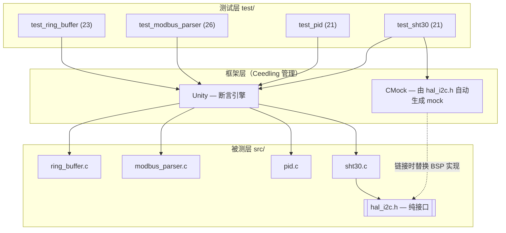

# 嵌入式 C 单元测试与质量保障框架（Ceedling · Unity · CMock）

[](https://github.com/orange0731/embedded-c-test/actions/workflows/ceedling.yml)


> Host-based unit-testing, coverage-gating and mutation-testing framework
> for embedded C modules. No target hardware required.

面向车载 / 工业嵌入式场景的宿主机单元测试与质量保障体系。对 4 个典型
C 模块（环形缓冲区、Modbus RTU 协议解析、PID 控制器、SHT30 温湿度驱动）
提供 **91 条单元测试、覆盖率质量门禁、变异测试与 CI 流水线**，
全部构建与执行在宿主机 gcc 上完成，不依赖目标硬件。

## 特性

- 91 条单元测试，Arrange-Act-Assert 结构，全部通过
- 语句覆盖率 100.0%、分支覆盖率 98.6%、函数覆盖率 100.0%（gcov + gcovr）
- 基于 CMock 的硬件抽象：4 种注入模式模拟 I²C 故障（NACK / 超时 / CRC 损坏 / 时序异常）
- 变异测试 6/6，自动化脚本并纳入 CI
- 覆盖率缺口全记录（coverage gap analysis），无"说不清"的未覆盖分支

## 效果展示


## 系统架构



## 快速开始

```bash
# 环境：Ubuntu / WSL2（工具链版本与 CI 一致，已 pin）
sudo apt install -y build-essential ruby-full "gcovr>=8,<9" || pip install "gcovr>=8,<9"
sudo gem install ceedling -v '~> 1.0'

# 运行全部单元测试
ceedling test:all

# 覆盖率报告 + 质量门禁（语句 ≥95% / 分支 ≥90%）
bash scripts/check_coverage.sh        # 报告：build/gcov/coverage.html

# 变异测试（6 个变异体应全部被杀死）
bash scripts/run_mutation.sh
```

## 项目结构

```
├── project.yml                  # Ceedling 主配置（CMock 插件 / gcov 报告）
├── src/                         # 被测生产代码（纯 C，无硬件依赖）
│   ├── ring_buffer.c/.h         #   环形缓冲区：count 判满空，调用者提供存储
│   ├── modbus_parser.c/.h       #   Modbus RTU 帧解析 + CRC16
│   ├── pid.c/.h                 #   PID：输出限幅 + 积分抗饱和 + NaN 防御
│   ├── sht30.c/.h               #   SHT30 驱动：CRC8 + 单位换算
│   └── hal_i2c.h                #   I2C 硬件抽象接口（仅声明，无实现）
├── test/                        # 91 条测试
├── scripts/
│   ├── check_coverage.sh        #   覆盖率质量门禁
│   └── run_mutation.sh          #   变异测试（基线检查 + 植入验证 + 中断恢复）
├── docs/
│   ├── mutation_report.md       #   变异测试杀伤力报告
│   └── images/                  #   报告截图
└── .github/workflows/ceedling.yml
```

## 测试矩阵与覆盖率

数据来源：`build/gcov/coverage.txt`（CI Artifacts 可下载）。

| 模块 | 用例 | 覆盖重点 | 语句 | 分支 |
|------|:---:|------|:---:|:---:|
| ring_buffer | 23 | 初始化边界、环绕 FIFO、满/空、NULL 与僵尸句柄、clear/peek、长序列一致性 | 100% | 97.6% |
| modbus_parser | 26 | CRC16 已知向量、长度边界、地址/广播、CRC 字节序、功能码与异常帧、数据语义双重一致性 | 100% | 98.1% |
| pid | 21 | P/I/D 分量、输出上下限、积分抗饱和（双向）、复位、dt≤0 与 NaN 防御、闭环收敛仿真 | 100% | 100% |
| sht30 | 21 | 命令字节序、CRC8 手册向量、读回 CRC 独立校验、错误传播与输出不污染契约、换算精度、Callback 假传感器、半路 NACK | 100% | 100% |
| **合计** | **91** | — | **100%** | **98.6%** |

**测试设计要点**：区分*已知答案测试*（CRC 国际标准向量 `0x4B37`、手册样例
`0xBEEF→0x92`）与*自洽性测试*（用被测 CRC 造帧验证解析逻辑），防止"自己测自己"；
错误路径一律用哨兵值断言"输出未被污染"；浮点断言区分精确值与近似值。

## 硬件抽象与 Mock 设计

驱动层通过依赖倒置与硬件解耦：`hal_i2c.h` 仅声明接口，量产由 BSP 实现，
测试由 CMock 自动生成替身——链接器即守门员。

```c
hal_i2c_read_ExpectAndReturn(SHT30_I2C_ADDR, NULL, 6u, HAL_I2C_OK);
hal_i2c_read_IgnoreArg_data();                            /* 出参地址不可预知：忽略 */
hal_i2c_read_ReturnArrayThruPtr_data(FRAME_25C_40RH, 6);  /* 回填模拟传感器数据 */
```

| CMock 模式 | 应用场景 |
|---|---|
| `ExpectWithArrayAndReturn` | 验证命令字节序（按内容比较，非指针） |
| `IgnoreArg` + `ReturnArrayThruPtr` | 出参回填：模拟传感器返回测量帧 |
| `ExpectAnyArgsAndReturn` | 故障注入：NACK / 超时 / 总线错误 / 越界枚举 |
| `StubWithCallback` | 行为型假硬件（回调内断言地址与长度） |
| `enforce_strict_ordering` | 强制验证"先写命令、后读数据"总线时序 |

Mock 保真策略：注入数据以数据手册已知向量与公式极值点锚定；Mock 只替代
电气层，协议语义在被测代码中真实执行；电气时序行为明确划归集成测试。

## 质量保障体系

**覆盖率门禁**（`scripts/check_coverage.sh`）：

```
clobber → gcov 插桩编译执行 → gcovr 汇总
→ --fail-under-line 95 / --fail-under-branch 90 → 不达标 exit 1
```

门禁本身经过失效路径自验证（阈值临时设为 100 确认正确报红后恢复）。

**变异测试**（`scripts/run_mutation.sh`，已纳入 CI）：6 个变异体
（差一 / 取模错误 / 边界运算符 / 状态丢失 / 限幅反向 / 兜底逻辑）全部被杀死。
其中 M6 曾暴露"default 分支不可达"的断言盲区，经越界枚举注入补强后杀死——
完整分析见 [docs/mutation_report.md](docs/mutation_report.md)。

**CI 流水线**：GitHub Actions，push / PR / 手动触发。工具链版本已 pin
（Ceedling `~> 1.0`，gcovr `>=8,<9`），步骤：单测 → 覆盖率门禁 → 变异测试 →
归档覆盖率报告（失败时也上传）。

## 覆盖率缺口分析

分支覆盖 98.6%，未覆盖分支均有定性记录：

1. **modbus_parser**：populate 阶段 `data_len == 0` 分支在现有校验规则下不可达
   （无任何合法帧数据区为 0），分析后接受；
2. **ring_buffer**：1 个防御性分支（`build/gcov/coverage.html` 逐行标注可查）。
   peek 的 NULL 句柄防御弧已在缺口分析后补强进既有用例并闭环。

## 设计决策

| 决策 | 理由 |
|---|---|
| Unity + CMock 而非 Google Test | 被测对象为纯 C，避免引入 C++ 语义偏差；CMock 从头文件自动生成 Mock，接口演进时维护成本最低 |
| `hal_i2c.h` 仅声明不实现 | 依赖倒置；防止空实现被意外链接进测试 |
| 环形缓冲区以 `count` 判满/空 | 代价 4 字节 RAM，消除 head==tail 时满/空歧义——可判定性即可测试性。注：ISR 共享场景需 SPSC + volatile 或临界区保护 |
| 解析器 populate-on-success | 错误帧不污染输出参数，契约以哨兵值断言 |
| CRC 位运算而非查表 | 可读性优先；已知向量测试构成重构安全网 |
| 非法输入尽早失败 | dt≤0 / NaN / NULL 均拒绝且不改写输出（NaN 无法被 `<=` 捕获，需 `isnan` 显式拦截） |
| 条件覆盖向 MC/DC 靠拢 | 复合条件的独立作用拆分为独立用例（如 0x10 双重一致性）；完整 MC/DC 度量列入 Roadmap |

## 改进路线

- [x] PID NaN / 非数值输入防御（isnan 拦截 + 污染隔离用例）
- [x] sht30 错误路径"输出不污染"契约断言全覆盖
- [x] 变异脚本加固（基线检查 / 植入验证 / 中断恢复）并纳入 CI
- [ ] CRC 查表法实现（已知向量测试作回归安全网）
- [ ] PID 微分冲击抑制：改为对测量值微分；积分限幅独立整定
- [ ] 广播地址策略收紧：仅写类功能码（0x06/0x10）响应广播
- [ ] 解析帧零拷贝视图（指针+长度替代 252 字节固定数组）
- [ ] CI 增加静态分析（cppcheck / clang-tidy）与 Sanitizer 构建（ASan/UBSan）
- [ ] 引入专业变异测试工具（如 Mull）交叉验证杀伤率
- [ ] 集成测试环境（SHT30 测量时序、总线电气行为）

## 文档

- [变异测试杀伤力报告](docs/mutation_report.md)

## 许可证

MIT（如仓库尚无 LICENSE，可在 GitHub 上 Add file → LICENSE → 选择 MIT 模板一键添加）
