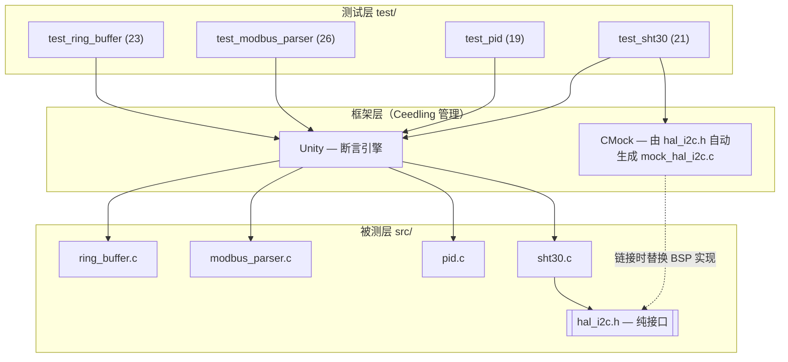

# 嵌入式 C 单元测试与覆盖率框架（Ceedling · Unity · CMock）

[](https://github.com/orange0731/embedded-c-ceedling-test/actions/workflows/ceedling.yml)


> Host-based unit-testing and quality-gating framework for embedded C modules,
> featuring CMock-based hardware abstraction, gcov/gcovr coverage gates,
> and mutation testing for test-effectiveness validation.

面向车载 / 工业嵌入式场景的宿主机（host-based）单元测试体系。对 4 个典型
C 模块（环形缓冲区、Modbus RTU 协议解析、PID 控制器、SHT30 温湿度驱动）
构建了 **89 条单元测试、覆盖率质量门禁、变异测试与 CI 流水线**。
不依赖任何目标硬件，使用宿主机 gcc 完成全部构建与执行。

**关键指标**（数据出处：`build/gcov/coverage.txt`，CI Artifacts 可下载）：

| 指标 | 数值 |
|---|---|
| 测试用例 | 89（全部通过） |
| 语句覆盖率 | 100.0%（193/193） |
| 分支覆盖率 | 98.6%（140/142，缺口见 §9 缺口分析） |
| 函数覆盖率 | 100.0%（20/20） |
| 变异测试得分 | 6/6（100%） |

## 1. 系统架构



## 2. 快速开始

```bash
# 环境：Ubuntu / WSL2，一次性安装工具链
sudo apt install -y build-essential ruby-full gcovr && sudo gem install ceedling

# 运行全部单元测试
ceedling test:all

# 覆盖率报告 + 质量门禁（语句 ≥95% / 分支 ≥90%）
bash scripts/check_coverage.sh        # 报告：build/gcov/coverage.html

# 变异测试（6 个变异体应全部被杀死）
bash scripts/run_mutation.sh
```

## 3. 项目结构

```
├── project.yml                  # Ceedling 主配置（CMock 插件 / gcov 报告）
├── src/                         # 被测生产代码（纯 C，无硬件依赖）
│   ├── ring_buffer.c/.h         #   环形缓冲区：count 判满空，调用者提供存储
│   ├── modbus_parser.c/.h       #   Modbus RTU 帧解析 + CRC16
│   ├── pid.c/.h                 #   PID 控制器：输出限幅 + 积分抗饱和
│   ├── sht30.c/.h               #   SHT30 驱动：CRC8 校验 + 单位换算
│   └── hal_i2c.h                #   I2C 硬件抽象接口（仅声明，无实现）
├── test/                        # 89 条测试，Arrange-Act-Assert 结构
├── scripts/
│   ├── check_coverage.sh        #   覆盖率质量门禁
│   └── run_mutation.sh          #   半自动变异测试
├── docs/
│   ├── mutation_report.md       #   变异测试杀伤力报告
│   └── images/                  #   报告截图
└── .github/workflows/ceedling.yml
```

## 4. 测试策略与覆盖矩阵

**设计原则**：

- 每个防御分支（NULL/越界/非法参数）都有对应用例——没有"不可测"的代码；
- 边界值成对验证（合法/非法各一侧），异常值与正常值分离；
- 浮点断言区分精确值（选二进制可表示的输入）与近似值（`FLOAT_WITHIN`）；
- 区分**已知答案测试**（CRC 国际标准向量 `0x4B37`、数据手册样例 `0xBEEF→0x92`）
  与**自洽性测试**（用被测 CRC 造帧验证解析逻辑），防止"自己测自己"。

| 模块 | 用例 | 覆盖重点 | 语句 | 分支 |
|------|:---:|------|:---:|:---:|
| ring_buffer | 23 | 初始化边界、环绕 FIFO、满/空、NULL 与僵尸句柄、clear/peek、长序列计数一致性 | 100% | 97.6% |
| modbus_parser | 26 | CRC16 已知向量、长度边界、地址匹配/广播、CRC 字节序、功能码与异常帧、数据语义双重一致性 | 100% | 98.1% |
| pid | 19 | P/I/D 分量独立验证、输出上下限、积分抗饱和（双向）、复位、dt≤0 防御、闭环收敛仿真 | 100% | 100% |
| sht30 | 21 | 命令字节序、CRC8 手册向量、读回 CRC 独立校验、NACK/超时/总线错误传播、换算精度、Callback 假传感器、半路 NACK 时序 | 100% | 100% |
| **合计** | **89** | — | **100%** | **98.6%** |

## 5. 硬件抽象与 Mock 设计

驱动层（sht30）通过**依赖倒置**与硬件解耦：`hal_i2c.h` 只声明接口，
量产构建由 BSP 提供实现，测试构建由 CMock 自动生成替身——链接器成为守门员。

```c
hal_i2c_read_ExpectAndReturn(SHT30_I2C_ADDR, NULL, 6u, HAL_I2C_OK);
hal_i2c_read_IgnoreArg_data();                            /* 出参地址不可预知：忽略 */
hal_i2c_read_ReturnArrayThruPtr_data(FRAME_25C_40RH, 6);  /* 回填模拟传感器数据 */
```

| CMock 模式 | 项目中的应用场景 |
|---|---|
| `ExpectWithArrayAndReturn` | 验证触发命令字节序（0x24, 0x00），按内容而非指针比较 |
| `IgnoreArg` + `ReturnArrayThruPtr` | 出参回填：模拟传感器返回 6 字节测量帧 |
| `ExpectAnyArgsAndReturn` | 错误注入：NACK / 超时 / 总线错误传播 |
| `StubWithCallback` | 行为型假硬件：回调内断言地址与长度，可扩展有状态仿真 |
| `enforce_strict_ordering` | 强制验证"先写命令、后读数据"的总线时序 |

**保真策略**：Mock 数据以数据手册已知向量与公式极值点（-45/25/130 °C）锚定；
Mock 只替代电气层，协议语义（CRC、字节序、长度）在被测代码中真实执行；
电气时序类行为（如测量等待）明确划归集成测试范围。

## 6. 覆盖率质量门禁

```
ceedling clobber → ceedling gcov:all（插桩编译+执行）→ gcovr 汇总
→ --fail-under-line 95 / --fail-under-branch 90 判定 → 不达标 exit 1
```

门禁本身经过**失效路径自验证**：将阈值临时设为 100（当前分支 98.6%）
确认 gcovr 正确报错并返回非零退出码，随后恢复——保证门禁不是"永远绿灯"。

产物：`build/gcov/coverage.html`（逐行标注）、`coverage.txt`（汇总）、
`coverage.xml`（Cobertura，供代码平台消费）。

## 7. 变异测试

测试充分性通过**变异测试**验证：向源码植入典型缺陷，要求套件必须变红。
6 个变异体（差一、取模错误、边界运算符、状态丢失、限幅反向、兜底逻辑）
**全部被杀死（6/6）**，过程自动化于 `scripts/run_mutation.sh`
（备份 → 植入 → 全量测试 → 判定 → 恢复，幂等可重复）。

其中 M6（`default` 兜底返回值写反）曾暴露套件的断言盲区：合法枚举全部命中
显式 case，`default` 分支不可达——通过注入越界枚举补强用例后杀死。
完整分析见 [docs/mutation_report.md](docs/mutation_report.md)。

## 8. CI 流水线

GitHub Actions（`.github/workflows/ceedling.yml`），push / PR 触发：

```
安装工具链 → ceedling test:all → check_coverage.sh（门禁）
→ 上传覆盖率报告（Artifacts，失败时也上传以便定位）
```

## 9. 覆盖率缺口分析

分支覆盖 98.6%（140/142），2 个未覆盖分支均有定性记录：

1. **modbus_parser**：populate 阶段 `data_len == 0` 分支在现有校验规则下
   不可达（无任何合法帧数据区为 0），分析后接受；
2. **ring_buffer**：1 个防御性分支（`build/gcov/coverage.html` 逐行标注可查）。
   peek 的 NULL 句柄防御弧已在缺口分析后补强进既有用例并闭环。

## 10. 设计决策与取舍

| 决策 | 取舍理由 |
|---|---|
| Unity + CMock 而非 Google Test | 被测对象为纯 C，避免引入 C++ 语义偏差；CMock 从头文件自动生成 Mock，接口演进时维护成本最低 |
| `hal_i2c.h` 仅声明不实现 | 依赖倒置；防止空实现被意外链接进测试，链接器即守门员 |
| 环形缓冲区以 `count` 判满/空 | 代价 4 字节 RAM，消除 head==tail 时满/空歧义——可判定性即可测试性 |
| 解析器 populate-on-success | 错误帧不污染输出参数，契约可断言（哨兵值用例验证） |
| CRC 位运算而非查表 | 可读性优先；已知向量测试构成安全网，未来换查表法重构零风险 |
| 条件覆盖向 MC/DC 思维靠拢 | 复合条件的独立作用拆分为独立用例（如 0x10 双重一致性）；完整 MC/DC 度量通常需商业工具，列为后续方向 |

## 11. 改进路线（Roadmap）

- [ ] CRC 查表法实现（已有已知向量测试作回归安全网）
- [ ] PID 微分冲击抑制：改为对测量值微分；积分限幅独立整定
- [ ] 广播地址策略收紧：仅写类功能码（0x06/0x10）响应广播
- [ ] 解析帧零拷贝视图（指针+长度替代 252 字节固定数组）
- [ ] CI 增加静态分析（cppcheck / clang-tidy）与 Sanitizer 构建（ASan/UBSan）
- [ ] 引入专业变异测试工具（如 Mull）交叉验证杀伤率
- [ ] 集成测试环境（SHT30 测量时序、总线电气行为）
