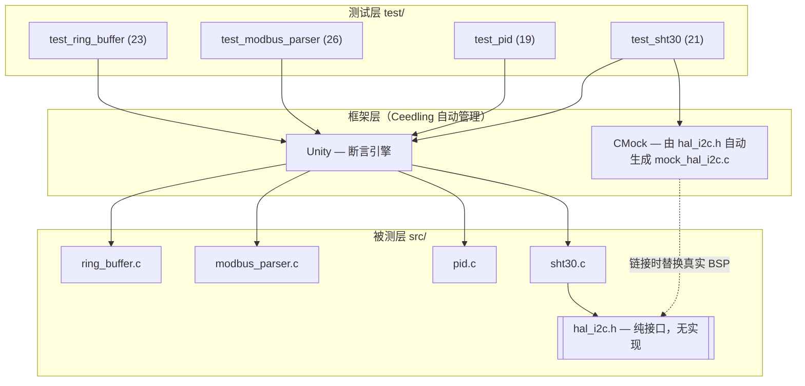

# 嵌入式 C 单元测试与覆盖率实践（Ceedling / Unity / CMock）


面向车载/工业嵌入式场景的**宿主机（host-based）单元测试体系**样板工程：
对 4 个典型模块（环形缓冲区、Modbus RTU 协议解析、PID 控制器、SHT30 温湿度驱动）
构建了 89 条单元测试、覆盖率质量门禁、变异测试与 CI 流水线。
目标：不依赖任何硬件，在 PC 上把"固件逻辑"测到量产级信心。

## 架构



## 快速开始（3 条命令）

```bash
# ① 一次性安装工具链（Ubuntu/WSL2）
sudo apt install -y build-essential ruby-full gcovr && sudo gem install ceedling
# ② 跑全部 89 条单元测试
ceedling test:all
# ③ 覆盖率报告 + 质量门禁（语句≥95% / 分支≥90%）
bash scripts/check_coverage.sh    # 报告：build/gcov/coverage.html
```

## 目录结构

```
├── project.yml                  # Ceedling 主配置（CMock 插件 / gcov 报告）
├── src/                         # 被测代码（纯 C，无硬件依赖）
│   ├── ring_buffer.c/.h         # 环形缓冲区（count 判满空，无 malloc）
│   ├── modbus_parser.c/.h       # Modbus RTU 帧解析 + CRC16
│   ├── pid.c/.h                 # PID（输出限幅 + 积分抗饱和）
│   ├── sht30.c/.h               # SHT30 驱动（CRC8 + 单位换算）
│   └── hal_i2c.h                # I2C 硬件抽象接口（只有声明）
├── test/                        # 89 条测试，AAA 结构
├── scripts/check_coverage.sh    # gcovr 覆盖率门禁
├── docs/mutation_report.md      # 变异测试杀伤力报告（6/6 杀死）
└── .github/workflows/ceedling.yml
```

## 测试矩阵与实测覆盖率

数据来源：`ceedling test:all`（89/89 通过）+ `gcovr --print-summary`
（聚合：lines **100.0%** 193/193 · branches **97.9%** 139/142 · functions **100.0%** 20/20）

| 模块 | 用例数 | 覆盖重点 | 语句覆盖 | 分支覆盖(gcov taken) |
|------|:---:|------|:---:|:---:|
| ring_buffer | 23 | 初始化边界、环绕 FIFO、满/空、NULL 与僵尸句柄、clear/peek、长序列计数一致性 | 100% | 95.2% |
| modbus_parser | 26 | CRC16 已知向量（0x4B37/样例帧）、长度边界、地址/广播、CRC 字节序、功能码与异常帧、数据语义双重一致性 | 100% | 98.1% |
| pid | 19 | P/I/D 分量独立验证、输出上下限、积分抗饱和（双向）、复位、dt≤0、闭环收敛仿真 | 100% | 100% |
| sht30 | 21 | 命令字节序、CRC8 手册向量（0xBEEF→0x92）、读回 CRC 独立校验、NACK/超时/总线传播、换算精度、Callback 假传感器、半路 NACK、越界枚举兜底 | 100% | 100% |
| **合计** | **89** | Mock：CMock×4 种武器 | **100%** | **97.9%** |

**未覆盖分支分析（coverage gap analysis）**：3 个未覆盖分支全部有记录——
modbus_parser populate 的 `data_len==0` 分支在现有校验规则下**不可达**
（无任何合法帧数据区为 0），分析后接受；ring_buffer 2 个防御性分支
（详见 `build/gcov/coverage.html` 逐行标注）。


## 为什么要 Mock 硬件？

`sht30` 依赖 I²C 总线，但 CI 服务器上没有传感器。解法是**把硬件依赖收敛到一个纯接口头文件**（`hal_i2c.h`），测试时由 CMock 生成假实现：

```c
/* 生产固件：hal_i2c.c 操作真实寄存器；单元测试：CMock 自动生成替身 */
hal_i2c_read_ExpectAndReturn(SHT30_I2C_ADDR, NULL, 6u, HAL_I2C_OK);
hal_i2c_read_IgnoreArg_data();                            /* 出参地址不可预知，忽略 */
hal_i2c_read_ReturnArrayThruPtr_data(FRAME_25C_40RH, 6);  /* 回填"传感器"数据 */
```

由此获得三种硬件上极难构造的能力：**确定性**（每次返回同样的 25°C 帧）、
**故障注入**（NACK/超时/CRC 损坏随时上演）、**速度**（89 条用例约 2 秒跑完）。
Mock 保真度用手册已知向量锚定（见 Q3）。

## 设计 Trade-off

1. **Unity + CMock 而非 Google Test**：GTest 需要 C++ 运行时且 Mock 要手写类继承；
   被测代码是纯 C——引入 C++ 只会增加与量产环境的偏差。
   CMock 直接从 `.h` 生成 Mock，接口变更时 Mock 自动跟随，维护成本最低。
2. **`hal_i2c.h` 只留接口（依赖倒置）**：驱动面向接口编程，链接期才决定是
   BSP 实现还是 Mock——"只有声明"让链接器成为守门员。
3. **环形缓冲区用 `count` 判满/空**：相比"浪费一格"多花 4 字节 RAM，
   换来 head==tail 时满/空无歧义——可判定性 = 可测试性。
4. **解析器 populate-on-success**：错误帧绝不写输出参数，
   `test_parse_detects_crc_error_and_leaves_output_untouched` 用哨兵值验证。
5. **CRC 位运算而非查表**：已知向量测试（0x4B37 / 0x92）做安全网，
   未来换查表法重构零风险。

## 面试 Q&A

**Q1：分支覆盖率和 MC/DC 有什么区别？**
分支覆盖率只要求每个分支真假各走一次；MC/DC（DO-178C A 级强制）要求
**每个独立条件都能独立影响判定结果**。`if (A && B)` 用 (1,1)/(0,0) 即达分支覆盖，
但 MC/DC 需要 (1,1)/(0,1)/(1,0) 证明 A、B 各自独立有效。本项目补丁用例
（如 crc8 的 `len==0` 独立条件、0x10 双重一致性拆开测）就是 MC/DC 思维。

**Q2：Stub 和 Mock 的区别？本项目哪里用了？**
Stub 只给返回值（状态验证），Mock 还验证交互（行为验证）。
`ExpectAnyArgsAndReturn(NACK)` 是 Stub；`ExpectWithArrayAndReturn(0x44, cmd, 2, ...)`
验证命令字节序是 Mock；`test_read_null_*_never_touches_i2c` 利用 CMock 隐含验证
——"零调用"本身也是交互断言。

**Q3：Mock 硬件会不会导致漏测？怎么保证 Mock 是真的？**
三道防线：① 已知答案锚定——CRC8 用手册样例 0xBEEF→0x92，换算用公式极值点
（-45/130°C）和精确点（25°C）；② Mock 只替代电气层，协议语义全部真实执行；
③ 承认残余风险——电气时序留给集成测试/HIL，单元测试职责边界讲清楚。

**Q4：环形缓冲区最难测的边界是什么？**
**环绕后 head==tail 的时刻**：物理上无法区分满与空。本项目用 count 字段消除歧义，
`test_full_after_wrap_around_rejects_push` 专门钉死；变异测试证明取模写错、
漏掉 count++ 都会被立刻抓住（M2/M3）。

**Q5：为什么不用 Google Test？**
被测对象是 C，测试链就不该引入 C++ 语义偏差；CMock 从头文件自动生成 Mock，
接口演进时维护成本远低于手写 GMock。

**Q6：为什么 `hal_i2c.h` 连空实现都不给？**
有空实现就可能被意外链接进测试，Mock 失去意义；"只有声明"让链接器当守门员，
是 ISO 26262"硬件抽象层"的落地形态。

**Q7：覆盖率 100% 就说明测试充分了吗？**
不能——覆盖率度量"执行过"，变异测试度量"断言有效"。本项目反例：
语句覆盖 99% 时变异体 M6（default 返回值写反）仍存活，因合法枚举全走显式 case；
注入越界枚举补强用例后才杀死（`docs/mutation_report.md`）。覆盖率是下限守门员，
变异测试才是充分性裁判。

**Q8：`dt=0` 为什么返回 false 而不是当 0 处理？**
除零产生 inf/NaN 并沿积分器扩散——嵌入式里"安静的错误"比"响亮的失败"可怕。
原则是非法输入尽早失败 + 不污染输出，测试用哨兵值 `-123.0f` 精确断言。

## 简历描述

**中文：**
> 基于 Ceedling（Unity+CMock）构建嵌入式 C 宿主机单元测试体系：覆盖环形缓冲区 /
> Modbus RTU 解析 / PID 控制 / SHT30 驱动 4 个模块共 **89** 条用例；以 gcov+gcovr
> 建立语句 ≥95%、分支 ≥90% 的 CI 质量门禁（实测**语句 100%、分支 97.9%**）；
> 设计 CMock 四种注入手段（ExpectWithArray / IgnoreArg / ReturnThruPtr / Callback），
> 实现 I²C NACK、超时、CRC 损坏等 10 余类故障场景；变异测试 6/6 杀死典型缺陷
> （差一/取模错误/边界运算符/状态丢失/限幅反向/兜底逻辑）；GitHub Actions 实现
> push 即测 + 门禁拦截 + 报告归档。

**English:**
> Built a host-based unit-testing framework for embedded C with Ceedling (Unity + CMock):
> **89 test cases** across ring buffer, Modbus RTU parser, PID controller and SHT30 sensor
> driver. Enforced CI quality gates (gcov + gcovr); measured **100% line / 97.9% branch
> coverage**. Designed four CMock injection patterns (ExpectWithArray, IgnoreArg,
> ReturnThruPtr, callback stubs) emulating 10+ I²C fault scenarios. Validated suite
> effectiveness via mutation testing — 6/6 seeded defects killed. Automated
> test → coverage gate → report pipeline with GitHub Actions.
