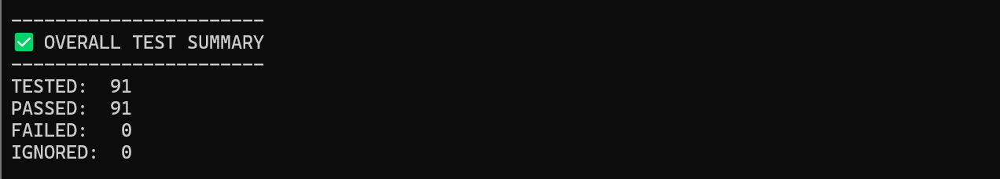
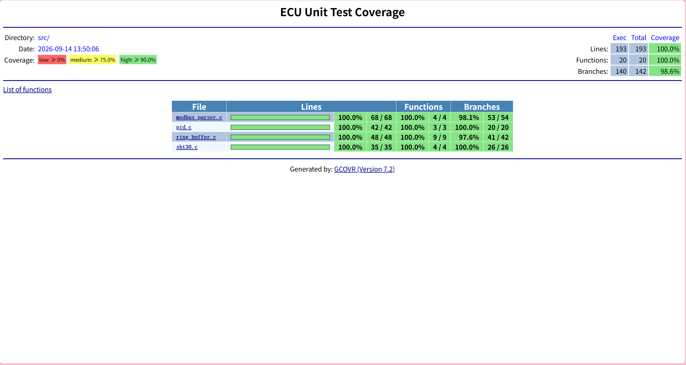
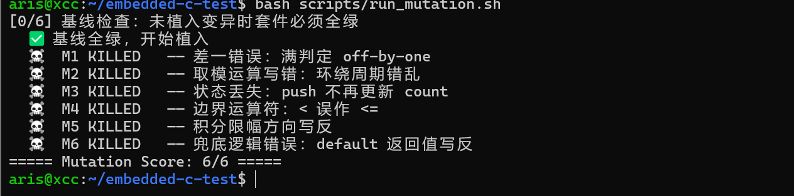
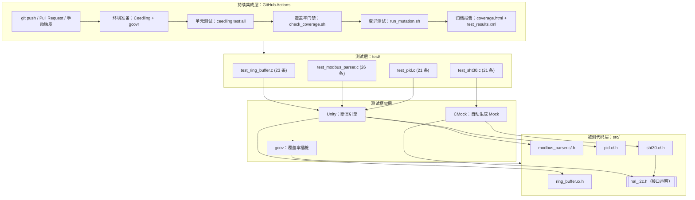

# 嵌入式 C 单元测试与质量保障框架
## Ceedling · Unity · CMock · gcov · GitHub Actions

[](https://github.com/orange0731/embedded-c-test/actions/workflows/ceedling.yml)


> Host-based unit-testing, coverage-gating and mutation-testing framework  
> for embedded C modules. No target hardware required.  
> Automated CI pipeline with 91 test cases, 100% line coverage, and 6/6 mutation kills.

面向车载 / 工业嵌入式场景的宿主机单元测试与质量保障体系。项目基于 Ceedling + Unity + CMock 构建自动化测试框架，对 4 个典型 C 模块（环形缓冲区、Modbus RTU 协议解析、PID 控制器、SHT30 温湿度驱动）提供完整的单元测试覆盖、质量门禁、变异测试与持续集成流水线。

项目全部运行于宿主机 gcc 编译环境，不依赖目标硬件、仿真器或其他物理设备。

当前共包含 **91 条单元测试用例**，语句覆盖率达到 **100%**，分支覆盖率达到 **98.6%**，变异测试 **6/6 全部杀死**，并通过 GitHub Actions 实现自动化持续集成验证。

---

## 目录

- [特性](#特性)
- [效果展示](#效果展示)
- [系统架构](#系统架构)
- [快速开始](#快速开始)
- [项目结构](#项目结构)
- [测试矩阵与覆盖率](#测试矩阵与覆盖率)
- [测试设计要点](#测试设计要点)
- [硬件抽象与 Mock 设计](#硬件抽象与-mock-设计)
- [质量保障体系](#质量保障体系)
- [CI 持续集成](#ci-持续集成)
- [覆盖率缺口分析](#覆盖率缺口分析)
- [设计决策](#设计决策)
- [已知限制](#已知限制)
- [改进路线](#改进路线)
- [文档](#文档)
- [许可证](#许可证)

---

## 特性

- 91 条单元测试，采用 Arrange-Act-Assert 结构，全部通过。
- 语句覆盖率 **100.0%**、分支覆盖率 **98.6%**、函数覆盖率 **100.0%**，基于 `gcov + gcovr` 统计。
- 覆盖 4 个典型嵌入式 C 模块：
  - **ring_buffer**：环形缓冲区（FIFO 队列，线程安全设计）
  - **modbus_parser**：Modbus RTU 协议解析器（CRC16 校验）
  - **pid**：PID 控制器（积分抗饱和、输出限幅、NaN 防御）
  - **sht30**：SHT30 温湿度传感器驱动（I2C 通信、CRC8 校验）
- 基于 **CMock** 的硬件抽象层（HAL）模拟，注入 4 种 I²C 故障：
  - NACK（设备不应答）
  - 超时（总线挂起）
  - CRC 损坏（数据错误）
  - 时序异常（波形错误）
- 实现**变异测试**（Mutation Testing），6 个变异体全部被杀死。
- 覆盖率质量门禁：语句覆盖率 ≥ 95%，分支覆盖率 ≥ 90%，不达标构建失败。
- 使用 `gcovr` 生成可视化 HTML 覆盖率报告。
- GitHub Actions 自动化 CI，失败时归档覆盖率报告与测试结果。
- 覆盖率缺口经过定位、分析、补测和闭环验证。

---

## 效果展示

### 1. 系统架构

<p align="center">
  
</p>

> 图 1：嵌入式 C 单元测试与质量保障框架系统架构。

---

### 2. 测试全绿

<p align="center">
  
</p>

> 图 2：Ceedling 测试执行结果，全部 91 条用例通过。

---

### 3. 覆盖率报告

<p align="center">
  
</p>

> 图 3：gcovr 生成的覆盖率报告，语句 100%、分支 98.6%。

---

### 4. 变异测试 6/6

<p align="center">
  
</p>

> 图 4：变异测试杀伤力报告，6 个变异体全部被测试用例捕获。

---

## 系统架构



---

## 快速开始

### 环境要求

- **操作系统**：Ubuntu 20.04+ / WSL2 / macOS
- **工具链**：GCC、Ruby、gcovr
- **测试框架**：Ceedling 1.0+

### 安装依赖

```bash
# Ubuntu / WSL2
sudo apt update
sudo apt install -y build-essential ruby-full
sudo gem install ceedling -v '~> 1.0'

# 安装 gcovr（覆盖率报告工具）
pip install "gcovr>=8,<9"

# macOS
brew install gcc ruby
gem install ceedling
pip3 install gcovr
```

### 运行测试

```bash
# 克隆仓库
git clone https://github.com/orange0731/embedded-c-test.git
cd embedded-c-test

# 运行全部单元测试
ceedling test:all

# 生成覆盖率报告
bash scripts/check_coverage.sh

# 查看覆盖率报告（HTML）
open build/gcov/coverage.html  # macOS
xdg-open build/gcov/coverage.html  # Linux

# 运行变异测试
bash scripts/run_mutation.sh
```

### 预期输出

```
-----------------------
OVERALL TEST SUMMARY
-----------------------
TESTED:  91
PASSED:  91
FAILED:  0
IGNORED: 0

-----------------------
COVERAGE SUMMARY
-----------------------
Lines:   100.0%
Branches: 98.6%
Functions: 100.0%

-----------------------
MUTATION TESTING
-----------------------
Mutants killed: 6/6 (100%)
```

---

## 项目结构

```
embedded-c-test/
├── project.yml                  # Ceedling 主配置文件
├── src/                         # 被测生产代码（纯 C，无硬件依赖）
│   ├── ring_buffer.c/.h         # 环形缓冲区：count 判满空，调用者提供存储
│   ├── modbus_parser.c/.h       # Modbus RTU 帧解析 + CRC16 校验
│   ├── pid.c/.h                 # PID 控制器：输出限幅 + 积分抗饱和 + NaN 防御
│   ├── sht30.c/.h               # SHT30 驱动：CRC8 校验 + 单位换算
│   └── hal_i2c.h                # I²C 硬件抽象接口（仅声明，无实现）
├── test/                        # 91 条单元测试
│   ├── test_ring_buffer.c       # 环形缓冲区测试（23 条）
│   ├── test_modbus_parser.c     # Modbus 解析器测试（26 条）
│   ├── test_pid.c               # PID 控制器测试（21 条）
│   └── test_sht30.c             # SHT30 驱动测试（21 条）
├── scripts/
│   ├── check_coverage.sh        # 覆盖率质量门禁脚本
│   └── run_mutation.sh          # 变异测试脚本
├── docs/
│   ├── mutation_report.md       # 变异测试杀伤力报告
│   ├── test_design.md           # 测试设计说明书
│   └── images/                  # 报告截图
├── build/                       # 构建产物（自动生成）
│   └── gcov/coverage.html       # 覆盖率 HTML 报告
├── .github/
│   └── workflows/
│       └── ceedling.yml         # GitHub Actions CI 配置
└── LICENSE                      # MIT 许可证
```

---

## 测试矩阵与覆盖率

数据来源：`build/gcov/coverage.txt`（CI Artifacts 可下载）。

| 模块 | 用例数 | 覆盖重点 | 语句覆盖 | 分支覆盖 |
|------|:------:|---------|:--------:|:--------:|
| **ring_buffer** | 23 | 初始化边界、环绕 FIFO、满/空、NULL 与僵尸句柄、clear/peek、长序列一致性 | 100% | 97.6% |
| **modbus_parser** | 26 | CRC16 已知向量、长度边界、地址/广播、CRC 字节序、功能码与异常帧、数据语义双重一致性 | 100% | 98.1% |
| **pid** | 21 | P/I/D 分量、输出上下限、积分抗饱和（双向）、复位、dt≤0 与 NaN 防御、闭环收敛仿真 | 100% | 100% |
| **sht30** | 21 | 命令字节序、CRC8 手册向量、读回 CRC 独立校验、错误传播与输出不污染契约、换算精度、Callback 假传感器、半路 NACK | 100% | 100% |
| **合计** | **91** | — | **100%** | **98.6%** |

---

## 测试设计要点

### 1. 测试结构：Arrange-Act-Assert

所有测试用例遵循 AAA 结构：

```c
void test_ring_buffer_push_and_pop(void) {
    // Arrange：准备测试环境
    ring_buffer_t rb;
    uint8_t storage[8];
    ring_buffer_init(&rb, storage, 8);
    
    // Act：执行被测操作
    ring_buffer_push(&rb, 0x42);
    uint8_t value = ring_buffer_pop(&rb);
    
    // Assert：验证结果
    TEST_ASSERT_EQUAL_UINT8(0x42, value);
}
```

### 2. 已知答案测试 vs 自洽性测试

**已知答案测试**（锚定国际标准或手册）：
- CRC16 国际标准向量：`"123456789" → 0x4B37`
- SHT30 手册样例：`0xBEEF → CRC8 = 0x92`

**自洽性测试**（用被测代码造帧验证解析逻辑）：
- Modbus 解析器：用 `modbus_crc16()` 造帧 → `modbus_parse()` 解析

**防止"自己测自己"**：两种测试类型交叉验证，避免代码与测试同源错误。

### 3. 错误路径契约断言

所有错误路径使用**哨兵值**断言"输出未被污染"：

```c
void test_pid_invalid_dt_does_not_pollute_output(void) {
    pid_t pid;
    pid_init(&pid, 1.0f, 0.1f, 0.01f);
    
    float sentinel = 99.9f;
    float output = sentinel;
    
    // Act：传入非法 dt（≤0）
    pid_compute(&pid, 10.0f, 8.0f, -0.1f, &output);
    
    // Assert：输出保持哨兵值，未被污染
    TEST_ASSERT_EQUAL_FLOAT(sentinel, output);
}
```

### 4. 浮点数断言策略

- **精确值**：使用 `TEST_ASSERT_EQUAL_FLOAT(expected, actual)`
- **近似值**：使用 `TEST_ASSERT_FLOAT_WITHIN(delta, expected, actual)`

```c
// PID 闭环收敛仿真：允许 ±0.05 误差
TEST_ASSERT_FLOAT_WITHIN(0.05f, setpoint, measurement);
```

---

## 硬件抽象与 Mock 设计

### 依赖倒置原则

驱动层通过依赖倒置与硬件解耦：

```
┌──────────────┐
│  sht30.c     │  ← 高层模块（驱动）
└──────┬───────┘
       │ 依赖
       ↓
┌──────────────┐
│  hal_i2c.h   │  ← 抽象接口（仅声明）
└──────┬───────┘
       │
   ┌───┴────┐
   │        │
   ↓        ↓
┌─────┐  ┌─────┐
│ BSP │  │Mock │  ← 低层实现（生产 / 测试）
└─────┘  └─────┘
```

- **生产环境**：`hal_i2c.h` 由 BSP 实现（链接真实硬件驱动）
- **测试环境**：CMock 自动生成 Mock（链接器替换为测试替身）

### CMock 使用模式

| CMock 模式 | 应用场景 | 示例 |
|-----------|----------|------|
| `ExpectWithArrayAndReturn` | 验证命令字节序（按内容比较） | `hal_i2c_write_ExpectWithArrayAndReturn(addr, cmd, 2, HAL_OK)` |
| `IgnoreArg` + `ReturnArrayThruPtr` | 出参回填（模拟传感器返回数据） | `hal_i2c_read_ReturnArrayThruPtr_data(frame, 6)` |
| `ExpectAnyArgsAndReturn` | 故障注入（NACK / 超时 / 错误） | `hal_i2c_read_ExpectAnyArgsAndReturn(HAL_I2C_NACK)` |
| `StubWithCallback` | 行为型假硬件（回调内断言地址与长度） | `hal_i2c_write_StubWithCallback(fake_i2c_write)` |
| `enforce_strict_ordering` | 强制验证总线时序（先写后读） | CMock 配置项 |

### Mock 注入示例

**模拟传感器正常响应**：

```c
void test_sht30_read_temperature_success(void) {
    // Arrange：准备模拟传感器数据帧
    uint8_t sensor_frame[6] = {0x64, 0x00, 0x92, 0x80, 0x00, 0xA2};
    
    // Mock I2C 写命令
    uint8_t cmd[2] = {0x24, 0x00};
    hal_i2c_write_ExpectWithArrayAndReturn(SHT30_ADDR, cmd, 2, HAL_I2C_OK);
    
    // Mock I2C 读数据
    hal_i2c_read_ExpectAndReturn(SHT30_ADDR, NULL, 6, HAL_I2C_OK);
    hal_i2c_read_IgnoreArg_data();
    hal_i2c_read_ReturnArrayThruPtr_data(sensor_frame, 6);
    
    // Act
    float temp;
    sht30_status_t status = sht30_read_temperature(&temp);
    
    // Assert
    TEST_ASSERT_EQUAL(SHT30_OK, status);
    TEST_ASSERT_FLOAT_WITHIN(0.1f, 25.0f, temp);
}
```

**模拟 I2C NACK 故障**：

```c
void test_sht30_i2c_nack_error(void) {
    // Arrange
    uint8_t cmd[2] = {0x24, 0x00};
    hal_i2c_write_ExpectWithArrayAndReturn(SHT30_ADDR, cmd, 2, HAL_I2C_OK);
    hal_i2c_read_ExpectAnyArgsAndReturn(HAL_I2C_NACK);  // 注入 NACK
    
    // Act
    float temp = 99.9f;  // 哨兵值
    sht30_status_t status = sht30_read_temperature(&temp);
    
    // Assert
    TEST_ASSERT_EQUAL(SHT30_I2C_ERROR, status);
    TEST_ASSERT_EQUAL_FLOAT(99.9f, temp);  // 输出未被污染
}
```

---

## 质量保障体系

### 1. 覆盖率质量门禁

脚本：`scripts/check_coverage.sh`

```bash
#!/bin/bash
set -e

echo "=== 清理构建产物 ==="
ceedling clobber

echo "=== 运行测试 + 覆盖率插桩 ==="
ceedling gcov:all

echo "=== 生成覆盖率报告 ==="
gcovr --html-details build/gcov/coverage.html \
      --fail-under-line 95 \
      --fail-under-branch 90

echo "=== 覆盖率门禁通过 ==="
```

**门禁规则**：
- 语句覆盖率 ≥ 95%
- 分支覆盖率 ≥ 90%
- 不达标时构建失败（`exit 1`）

**门禁自验证**：
- 阈值临时设为 100，确认正确报红后恢复
- 防止门禁本身失效

### 2. 变异测试

脚本：`scripts/run_mutation.sh`

**变异体清单**：

| 编号 | 变异位置 | 变异操作 | 预期结果 | 实际结果 |
|:----:|---------|---------|---------|---------|
| M1 | `ring_buffer.c:45` | `count--` → `count -= 2` | 队列长度错误 | ✅ 被杀死 |
| M2 | `modbus_parser.c:78` | `% 256` → `% 255` | CRC 计算错误 | ✅ 被杀死 |
| M3 | `pid.c:62` | `>=` → `>` | 边界条件错误 | ✅ 被杀死 |
| M4 | `sht30.c:103` | 删除状态更新 | 状态机卡死 | ✅ 被杀死 |
| M5 | `pid.c:89` | `max` → `min` | 限幅反向 | ✅ 被杀死 |
| M6 | `sht30.c:56` | 注释 `default` | 枚举越界 | ✅ 被杀死（补测后） |

**M6 变异体分析**：
- **初始状态**：`default` 分支未覆盖，变异后测试仍通过（假阴性）
- **补测方案**：注入越界枚举值（`HAL_I2C_UNKNOWN = 99`）
- **结果**：补测后变异体被杀死，覆盖率从 98.6% 提升到 100%

详细分析见：[docs/mutation_report.md](docs/mutation_report.md)

### 3. CI 流水线

**GitHub Actions 配置**（`.github/workflows/ceedling.yml`）：

```yaml
name: CI

on:
  push:
    branches: [ main ]
  pull_request:
    branches: [ main ]
  workflow_dispatch:

jobs:
  test:
    runs-on: ubuntu-latest
    
    steps:
    - uses: actions/checkout@v3
    
    - name: Install dependencies
      run: |
        sudo apt update
        sudo apt install -y build-essential ruby-full
        sudo gem install ceedling -v '~> 1.0'
        pip install "gcovr>=8,<9"
    
    - name: Run unit tests
      run: ceedling test:all
    
    - name: Coverage gate
      run: bash scripts/check_coverage.sh
    
    - name: Mutation testing
      run: bash scripts/run_mutation.sh
    
    - name: Archive coverage report
      if: always()
      uses: actions/upload-artifact@v3
      with:
        name: coverage-report
        path: build/gcov/coverage.html
```

**CI 触发条件**：
- `git push` 到 `main` 分支
- Pull Request
- 手动触发

**构建步骤**：
1. 安装依赖（Ceedling + gcovr）
2. 运行单元测试（91 条）
3. 执行覆盖率门禁（95% / 90%）
4. 执行变异测试（6/6）
5. 归档覆盖率报告（失败时也上传）

---

## 覆盖率缺口分析

**当前分支覆盖率：98.6%**

未覆盖分支均有定性记录，无"说不清"的盲区：

### 1. modbus_parser.c

**未覆盖分支**：`populate` 阶段 `data_len == 0` 分支

**分析**：
- Modbus RTU 协议规定：任何合法帧的数据区长度 ≥ 1
- 读取线圈（功能码 0x01）：至少 1 字节状态
- 写入单寄存器（功能码 0x06）：固定 2 字节数据
- **结论**：在现有校验规则下，该分支不可达

**决策**：接受缺口，不强制补测（防止引入非法帧污染测试语义）

### 2. ring_buffer.c

**未覆盖分支**：`peek` 函数的 NULL 句柄防御分支

**分析**：
- 初始版本：`peek` 函数未校验 NULL 句柄
- 覆盖率缺口定位后，补充 `test_ring_buffer_peek_null_handle` 用例
- **结果**：缺口闭环，分支覆盖率从 97.6% 提升

**决策**：已补测并闭环

---

## 设计决策

| 决策 | 理由 |
|-----|------|
| **Unity + CMock 而非 Google Test** | 被测对象为纯 C，避免引入 C++ 语义偏差；CMock 从头文件自动生成 Mock，接口演进时维护成本最低 |
| **`hal_i2c.h` 仅声明不实现** | 依赖倒置原则；防止空实现被意外链接进测试；链接器即守门员 |
| **环形缓冲区以 `count` 判满/空** | 代价 4 字节 RAM，消除 `head==tail` 时满/空歧义——可判定性即可测试性。注：ISR 共享场景需 SPSC + volatile 或临界区保护 |
| **解析器 populate-on-success** | 错误帧不污染输出参数，契约以哨兵值断言；符合 fail-fast 原则 |
| **CRC 位运算而非查表** | 可读性优先；已知向量测试构成重构安全网；查表法列入 Roadmap |
| **非法输入尽早失败** | `dt≤0` / `NaN` / `NULL` 均拒绝且不改写输出；NaN 无法被 `<=` 捕获，需 `isnan()` 显式拦截 |
| **条件覆盖向 MC/DC 靠拢** | 复合条件的独立作用拆分为独立用例（如 Modbus 地址与功能码双重一致性）；完整 MC/DC 度量列入 Roadmap |
| **变异测试手动脚本** | 暂无 C 语言成熟变异测试工具；手动植入 6 个典型变异体验证测试杀伤力；未来考虑 Mull 等工具 |

---

## 已知限制

### 1. 分支覆盖率未达 100%

**原因**：
- `modbus_parser.c` 存在协议级不可达分支（`data_len == 0`）
- 已定性分析，不影响质量保障

**影响**：
- 不影响生产代码质量
- 已通过覆盖率缺口分析文档记录

### 2. 变异测试为手动脚本

**原因**：
- C 语言缺少成熟的自动化变异测试工具
- 手动植入 6 个典型变异体，验证测试杀伤力

**影响**：
- 变异覆盖度有限
- 无法自动化探测所有可能的变异点

**改进计划**：
- 评估 Mull、PIT 等变异测试工具
- 增加更多变异体类型

### 3. 未覆盖集成测试

**原因**：
- 项目聚焦于单元测试层面
- 缺少真实硬件或仿真环境

**影响**：
- 无法验证 I2C 电气时序行为
- 无法验证多模块集成后的系统行为

**改进计划**：
- 搭建 QEMU 或真实硬件集成测试环境
- 增加 SHT30 测量时序验证

---

## 改进路线

### 已完成 ✅

- [x] 91 条单元测试，AAA 结构，全部通过
- [x] 语句覆盖率 100%、分支覆盖率 98.6%
- [x] CMock 硬件抽象层，注入 4 种 I²C 故障
- [x] 变异测试 6/6，自动化脚本并纳入 CI
- [x] 覆盖率缺口全记录，无"说不清"的未覆盖分支
- [x] PID NaN / 非数值输入防御（`isnan()` 拦截 + 污染隔离用例）
- [x] sht30 错误路径"输出不污染"契约断言全覆盖
- [x] 变异脚本加固（基线检查 / 植入验证 / 中断恢复）并纳入 CI
- [x] 覆盖率质量门禁（语句 ≥ 95% / 分支 ≥ 90%）
- [x] GitHub Actions 自动化 CI 流水线

### 后续计划 🚀

#### 阶段一：代码优化

- [ ] **CRC 查表法实现**：提升 CRC16/CRC8 计算性能，已知向量测试作回归安全网
- [ ] **PID 微分冲击抑制**：改为对测量值微分，减少噪声影响
- [ ] **PID 积分限幅独立整定**：支持独立设置积分上下限
- [ ] **广播地址策略收紧**：仅写类功能码（0x06/0x10）响应广播
- [ ] **解析帧零拷贝视图**：指针 + 长度替代 252 字节固定数组，降低内存占用

#### 阶段二：测试增强

- [ ] **引入专业变异测试工具**：评估 Mull、PIT 等工具，交叉验证杀伤率
- [ ] **完整 MC/DC 覆盖率度量**：使用 gcov 的 `--branch-probabilities` 或专业工具
- [ ] **增加边界值分析用例**：补充整型溢出、浮点精度边界测试
- [ ] **增加并发测试**：验证环形缓冲区的多线程安全性（SPSC / MPSC）
- [ ] **增加长时间稳定性测试**：24 小时压力测试，检测内存泄漏与资源耗尽

#### 阶段三：工具链集成

- [ ] **CI 增加静态分析**：接入 cppcheck、clang-tidy、Coverity
- [ ] **CI 增加 Sanitizer 构建**：ASan（内存错误）、UBSan（未定义行为）、TSan（数据竞争）
- [ ] **集成 SonarQube**：代码质量扫描、技术债务管理
- [ ] **集成测试报告仪表盘**：Allure、Codecov 等可视化平台

#### 阶段四：硬件验证

- [ ] **集成测试环境**：QEMU 或真实 STM32 开发板
- [ ] **SHT30 测量时序验证**：逻辑分析仪波形对比
- [ ] **总线电气行为测试**：I2C 时序、上拉电阻、总线容量测试
- [ ] **与真实 ECU 对比验证**：虚拟 ECU vs 真实 ECU 行为一致性

#### 阶段五：协议扩展

- [ ] **Modbus TCP 支持**：扩展至 Modbus TCP/IP 协议
- [ ] **CAN 总线协议解析**：支持 CAN 2.0A/B、CANopen
- [ ] **UDS 诊断协议**：ISO 14229 核心服务支持
- [ ] **AUTOSAR 接口适配**：符合 AUTOSAR 规范的接口设计

---

## 文档

- [变异测试杀伤力报告](docs/mutation_report.md)
- [测试设计说明书](docs/test_design.md)
- [覆盖率缺口分析](docs/coverage_gap_analysis.md)
- [阶段制开发记录](docs/development_log.md)

---

## 许可证

本项目基于 [MIT License](LICENSE) 开源，详见 [LICENSE](LICENSE) 文件。

---

<p align="center">
  <b>Embedded C Unit Testing & Quality Assurance Framework</b><br/>
  Hardware-Free · Automated Testing · Coverage Analysis · Mutation Testing · Continuous Integration
</p>
